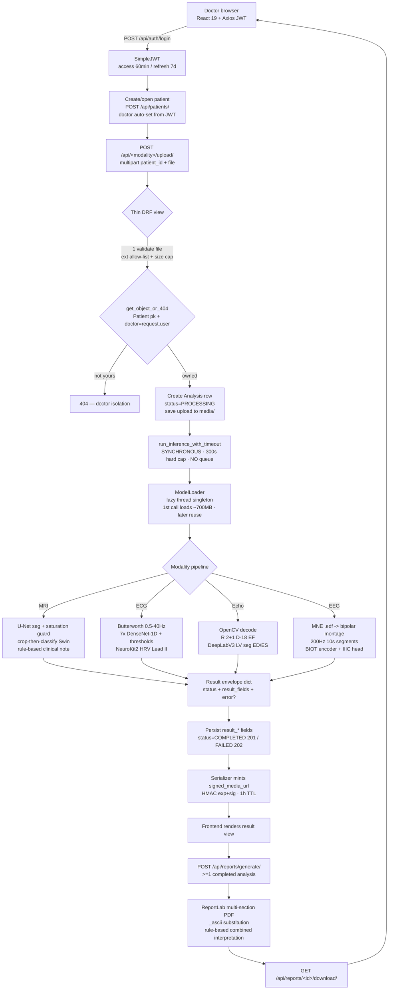

# Project Work — Architecture, Results & Critical Review (v2)

**Multimodal Medical AI Platform — Master's PFE, Université Constantine 2**
**Author:** Mazen · **Compiled:** 2026-06-12

> **What this document is.** A single, exhaustive, defence-grade account of the project: how it works, what the models are, what the results were *before* and *after* my changes, what I focused on (recall) and why, how my numbers compare to the source papers/datasets, what the project is worth, where it falls short, and a concrete remediation plan ordered from *must-do* to *optional*.
>
> **Verification provenance (read this first).** Every load-bearing number below was re-checked against the live source code and the committed evaluation logs — not copied from prose. Where two documents disagreed, I traced the conflict to its source files and recorded the **authoritative** value (Section 6.2). During this pass I also (a) confirmed the recall-first operating points and fine-tuned weights are genuinely wired in as the runtime default (Appendix A), (b) discovered that the deployed MRI classifier is actually a **Swin Transformer**, not the "ViT-B/16" the older docs claim (§1.8.1), (c) confirmed the previously-flagged unauthenticated `/media/` PHI hole is **already closed** in the live code (§1.6), and (d) applied one safe code fix — the ECG report now prints full names for `RBBB`/`LBBB` instead of bare codes (Appendix B). Citations use `file:line`.

---

## Table of contents

1. [Project explanation (architecture + all model architectures)](#1-project-explanation)
2. [Results — original vs. changed](#2-results--original-vs-changed)
3. [Focus of work — recall, and why](#3-focus-of-work--recall)
4. [Comparison with external sources](#4-comparison-with-external-sources)
5. [Value of my work](#5-value-of-my-work)
6. [Shortcomings and mistakes](#6-shortcomings-and-mistakes)
7. [Solve this problem — prioritised remediation](#7-solve-this-problem)
- [Appendix A — Weights & parameter verification](#appendix-a--weights--parameter-verification)
- [Appendix B — Code change applied in this pass](#appendix-b--code-change-applied-in-this-pass)
- [Appendix C — Knowledge-graph view (graphify)](#appendix-c--knowledge-graph-view-graphify)

---

# 1. Project explanation

## 1.1 What the platform does

A web-based **clinical decision-support platform** that runs **pretrained deep-learning models** on four independent classes of medical data and merges the per-patient findings into one downloadable PDF report (`README.md:8-12`, `docs/HOW-IT-WORKS.md:10-16`).

| Modality | Input formats | Model(s) | Primary output |
|---|---|---|---|
| **Brain MRI** | PNG/JPG/TIFF/DICOM/NIfTI | Swin Transformer (4-class) + U-Net (segmentation) | tumour mask/overlay + type ∈ {glioma, meningioma, no_tumor, pituitary} |
| **12-lead ECG** | CSV / EDF / WFDB (.dat+.hea) | DenseNet-1D-121 × 7 (ecglib) + NeuroKit2 (HRV) | 7 binary pathology probabilities + HRV metrics |
| **Echocardiogram** | .avi / .mp4 video | DeepLabV3-ResNet50 (LV seg) + R(2+1)D-18 (EF regression) | EF %, EF category, ED/ES areas, LV overlay |
| **EEG** | .edf (≤ 200 MB) | BIOT encoder + fine-tuned IIIC 6-class head | IIIC distribution {SZ, LPD, GPD, LRDA, GRDA, Other}, dominant pattern, harmful flag |

**Scope honesty — carry this into the defence.** The four pipelines are **independent**; there is **no learned multimodal fusion**. The "combined interpretation" in the PDF is **rule-based template text**, not a learned neuro-cardiac correlation (`docs/HOW-IT-WORKS.md:235-238`). The genuine contribution is the **integration architecture and the honest validation**, not the borrowed models (`docs/HOW-IT-WORKS.md:16`). EEG is **functional** critical-care screening (a complement to the *structural* MRI), never a tumour detector (`docs/HOW-IT-WORKS.md:187-190`).

## 1.2 Three-tier architecture

```
┌────────────────────────────────────────────────────────────────────┐
│  PRESENTATION   React 19 + Vite 8 SPA (Redux, Tailwind, R3F 3D)     │
│                 Axios client: attaches JWT, 401 → /login, 5-min cap │
└──────────────────────────────┬─────────────────────────────────────┘
                               │ REST/JSON + JWT bearer
┌──────────────────────────────▼─────────────────────────────────────┐
│  APPLICATION    Django 3.2.25 LTS + DRF + SimpleJWT                 │
│                 8 apps · synchronous inference in request thread    │
│                 Lazy singleton ModelLoader (≈700 MB weights cached) │
└──────────────────────────────┬─────────────────────────────────────┘
                               │
┌──────────────────────────────▼─────────────────────────────────────┐
│  DATA           MongoDB 7.x via djongo  +  media/ filesystem (PHI)  │
│                 PHI streamed only through HMAC-signed /media/ view  │
└────────────────────────────────────────────────────────────────────┘
```

## 1.3 Full request/data flow (upload → inference → report)



Inference **blocks the HTTP request** (no Celery/RQ); that is why the Axios client uses a 5-minute timeout (`docs/HOW-IT-WORKS.md:67-75`). The result is always a plain dict `{status, …result_fields, error?, error_type?}` — pipelines never raise into the view (the **result-envelope contract**, §1.6).

## 1.4 Backend stack

| Concern | Choice | Evidence |
|---|---|---|
| Framework | **Django 3.2.25 LTS** + DRF 3.14.0 | `README.md:115` |
| Auth | **SimpleJWT** — 60-min access / 7-day refresh, `Bearer` header | `backend/core/settings.py:172-176` |
| Database | **MongoDB 7.x via djongo 1.3.6** | `backend/core/settings.py:85-94` |
| Config | secrets/DB/CORS via **python-decouple** from `backend/.env`; `SECRET_KEY` required | `backend/core/settings.py:10-16` |
| Inference | **synchronous in request thread, no Celery/RQ**; lazy thread singleton `ModelLoader`, CUDA-if-available else CPU | `docs/HOW-IT-WORKS.md:73-75` |
| ML stack | PyTorch 2.2.0, torchvision 0.17, transformers 4.38.0, ecglib **1.0.1 (exact pin)**, NeuroKit2 0.2.7, MNE 1.12, BIOT (vendored) | `README.md:118-124` |
| Test DB | swaps to in-memory SQLite when `'test' in sys.argv` (djongo can't make a throwaway test DB) | `backend/core/settings.py:96-107` |

**Registered apps** (`apps.<name>` dotted prefix): `authentication, patients, mri, ecg, echo, eeg, reports, inference`.

| App | Responsibility |
|---|---|
| `authentication` | Custom email-login `User`; JWT issue/refresh |
| `patients` | Doctor-scoped CRUD + `/history/` aggregate |
| `mri` / `ecg` / `echo` / `eeg` | Upload + synchronous inference + result URLs |
| `reports` | ReportLab PDF + rule-based combined interpretation; survives patient deletion via null FK |
| `inference` | Lazy singleton `ModelLoader` + 4 pipelines + utils; vendored BIOT under `biot/`; shared `eeg_preprocess.py` |

**URL prefixes:** `api/auth/`, `api/` (patients), `api/mri/`, `api/ecg/`, `api/echo/`, `api/eeg/`, `api/reports/`, `media/<path>` (signed).

**Hard version constraints (deliberate).** Python 3.10/3.11 (djongo breaks on 3.12+); Django pinned 3.2.25 because djongo is incompatible with Django 4.x — the build spec asked for 4.2 and was *deliberately downgraded*; ecglib pinned exactly 1.0.1; frontend port 3000 + backend CORS coupled.

## 1.5 Frontend stack

React 19 + Vite 8 (strictPort 3000); Redux Toolkit slices (`auth`, `patients`, `notifications`); Axios interceptor (JWT attach, 401 → `/login`); react-router-dom 6 with a `ProtectedRoute` gate; Tailwind 3.4 utilities; Three.js / react-three-fiber dark-neon 3D UI (particle field, 3D brain/heart); light/dark theme + EN/FR i18n via `ThemeProvider`/`useTokens` and `LanguageProvider`/`useI18n`. Per-domain modules under `frontend/src/modules/{Auth,Dashboard,Patients,MRI,ECG,Echo,EEG,Reports}/`; functional components only (`ErrorBoundary` is the documented class exception). The **patient-detail page is the hub** (tabs for each modality + Reports).

## 1.6 The two contracts + signed media (PHI)

1. **Doctor isolation.** Every queryset in `patients, mri, ecg, echo, reports` filters by the requesting doctor along the FK chain **`<Analysis> → patient → doctor`**, enforced concretely by `get_object_or_404(Patient, pk=patient_id, doctor=request.user)` in upload views. A new endpoint returning another doctor's data is a bug.
2. **Result envelope.** Every inference function returns `{status, …result_fields, error?, error_type?}` and never raises into the view, so the API can report partial results (e.g. a runtime 6/7 ECG models) instead of an opaque 500.

**Signed media (PHI) — previously-flagged hole is closed.** PHI (uploads, masks/overlays/plots, PDFs) lives under `MEDIA_ROOT`. Serving that tree publicly would let anyone guessing a `/media/...` path read another doctor's data. The live code closes this: the API never returns a raw `/media/` URL — serializers call `signed_media_url(request, url, ttl)`, appending a short-lived HMAC `exp`+`sig` (`hmac_sha256(secret, "<rel_path>:<exp>")`, `backend/core/media.py:58-60`); `serve_signed_media` validates (missing/expired/forged sig → 403, traversal → 404) before streaming (`backend/core/media.py:78-106`); mounted via `re_path(r'^media/(?P<path>.+)$', serve_signed_media)` (`backend/core/urls.py:20`); TTL default **3600 s** (`settings.py:141`). **This means the audit's "#1 critical: unauthenticated /media/ PHI exposure" is already mitigated in code** (to time-scoped, not-yet-per-identity access). The older narrative docs that still call it open are *stale* and must be reconciled before the defence (§6.2, conflict K7).

## 1.7 Modality-agnostic plug-in design (the principal engineering contribution)

Each medical domain is an isolated plug-in. Adding one (CT, genomics, …) follows an **8-step recipe** without touching existing modality code or the auth core (`CONTRIBUTING.md#adding-a-new-modality`): **pipeline → loader → app → model+migration → serializer+views → URL → frontend module → reports section.** Both contracts (§1.6) must be obeyed by any new modality. This plug-in architecture — not the borrowed models — is the named principal engineering contribution.

## 1.8 Model architectures (all of them, in detail)

All four modalities load through one process-wide singleton `ModelLoader` (`model_loader.py:18`): lazy (built on first request), cached (reused after), device-aware (`get_device()` → `'cuda'` else `'cpu'`). `warmup()` pre-loads **only MRI + ECG**, never Echo/EEG (their weights are disk-only) — `model_loader.py:372-378`.

### 1.8.1 MRI — two stage (Swin classifier + U-Net segmentation)

**Stage A — classifier. ⚠ It is a Swin Transformer, not "ViT-B/16".** The deployed checkpoint `backend/models_weights/vit_brain_tumor/config.json` declares `architectures: ["SwinForImageClassification"]`, `model_type: "swin"`, `image_size: 224`. The HuggingFace source model `Devarshi/Brain_Tumor_Classification` is a **Swin-Tiny** (Liu et al., *Swin Transformer*, ICCV 2021), a hierarchical/shifted-window vision transformer — `embed_dim 96`, `depths [2,2,6,2]`, `window 7`, `patch 4`, i.e. the Swin-T configuration, **~28 M params, ~110 MB** (base backbone `microsoft/swin-tiny-patch4-window7-224`, not Google ViT-B/16). It is loaded generically via `AutoModelForImageClassification` (`model_loader.py:109-148`), so the directory name `vit_brain_tumor` and the "ViT-B/16" wording in the docs are **imprecise** — the *code is correct*, the *docs are wrong*. 4 classes from `id2label`: glioma=0, meningioma=1, no_tumor=2, pituitary=3.
- *Preprocessing/decision:* if a tumour was segmented, the image is cropped to the mask bounding box (+10 px) before classification (`mri_pipeline.py:233`); else the full image. HF processor resize/normalize → softmax → argmax. **Notumor confidence gate (recall-first):** `NOTUMOR_MIN_CONFIDENCE = 0.99` — a `notumor` verdict is cleared only when `cls_conf ≥ 0.99` **and** the U-Net found no tissue, else `screening_flag = 'possible_tumor_review'` (`mri_pipeline.py:256-263`).
- *Weights:* fine-tuned local dir takes precedence (present here, 95.4 %); falls back to stock hub (~80.4 %) with a warning if absent.

**Stage B — segmentation U-Net.** `mateuszbuda/brain-segmentation-pytorch` U-Net (encoder-decoder + skips, `in=3, out=1, init_features=32`, ~7.7 M params, ~30 MB), `pretrained=True` from torch Hub. **Critical:** the U-Net applies `sigmoid` *inside* `forward()`, so its output is already a probability map; the pipeline thresholds it directly — `binary_mask = (prob_map > 0.5).float()` with **no second sigmoid** (`mri_pipeline.py:205-206`; the historical double-sigmoid bug is documented at `:198-204`). A **saturation guard** (`> 0.75` of the image ⇒ reject as degenerate) and a 50-pixel noise floor protect the verdict.
- *Cross-model agreement:* `compute_model_agreement` flags `'uncertain'` when U-Net and the classifier disagree (tumour-vs-notumor) — `mri_pipeline.py:124-155`.

### 1.8.2 ECG — ecglib DenseNet-1D-121 ensemble (7 binary) + NeuroKit2 HRV

- *Model:* `ecglib` (ISPRAS) **DenseNet-1D-121**, one binary classifier per pathology, ensemble of 7: `[AFIB, 1AVB, STACH, SBRAD, RBBB, LBBB, PVC]` (~8 M params each, pretrained on 500 k+ ECGs). Each model loads independently; a mid-request failure logs a warning and continues (the partial-result contract).
- *Preprocessing:* signal standardised to **(12 leads × 5000 samples @ 500 Hz, ~10 s)**; leads reordered to canonical I,II,III,aVR…V6 by label; **4th-order Butterworth band-pass 0.5–40 Hz** + **per-lead z-score** (`ecg_pipeline.py:178-183`).
- *Decision:* per-pathology calibrated thresholds (`DETECTION_THRESHOLDS`), recall-first by default (§3). Primary diagnosis = highest detected pathology, else "Normal Sinus Rhythm".
- *Parallel HRV stream (rule-based, not the NN):* NeuroKit2 on Lead II → mean HR + RMSSD/SDNN/pNN50, a cross-check that adds brady/tachy/high-HRV flags.
- *Weights:* stock ecglib by default; fine-tuned `<PATHOLOGY>.pt` checkpoints take precedence — **3 of 7 present (1AVB, RBBB, PVC)** (§Appendix A).

### 1.8.3 Echo — EchoNet-Dynamic (DeepLabV3 LV seg + R(2+1)D-18 EF regression)

- *Segmentation:* `deeplabv3_resnet50` with the classifier replaced by `Conv2d(256, 1)` → 1-channel LV mask.
- *EF regression:* `r2plus1d_18` (R(2+1)D-18 video CNN) with `fc → Linear(_, 1)` → scalar EF.
- *Preprocessing:* OpenCV decode → 112×112 RGB frames + EchoNet mean/std; EF averaged over ≤ 4 clips of 32 frames (stride 2); DeepLabV3 per-frame masks → ED (max area) / ES (min non-zero area).
- *Decision:* EF clamped [0,100]; category `<40 = Reduced (HFrEF)`, `<50 = Mildly reduced`, else Normal; **reduced-EF screen** flags review at `EF < REDUCED_EF_SCREEN_CUTOFF = 55.0` (a +5 % margin over the 50 % clinical cutoff).
- *Weights:* **not bundled, not auto-downloaded** — `echonet_seg.pt` + `echonet_ef.pt` loaded from disk, clear `FileNotFoundError` if absent.

### 1.8.4 EEG — BIOT (Biosignal Transformer) encoder + fine-tuned IIIC 6-class head

Vendored from `ycq091044/BIOT` (Yang et al., NeurIPS 2023) at `apps/inference/biot/biot.py`.
- *Architecture* (`BIOTClassifier` = `BIOTEncoder` + `ClassificationHead`): per-channel **STFT** (`n_fft=200, hop=100, onesided` → 101 freq bins) → `PatchFrequencyEmbedding` (Linear 101→256) → add learned per-channel token + sinusoidal positional encoding → concatenate all 16 channels → **LinearAttentionTransformer** (dim 256, 8 heads, depth 4) → mean-pool → `ELU` + `Linear(256, 6)`.
- *Preprocessing* (`eeg_preprocess.py`, train/inference parity — constants frozen): MNE reads a referential 10-20 EDF (refuses already-bipolar montages); resample **200 Hz**; build the 16-channel longitudinal-bipolar "double-banana" montage in BIOT's exact order; split into non-overlapping **10 s = 2000-sample** segments; **per-channel 95th-percentile amplitude normalization** (scale-invariant, so V-vs-µV is moot).
- *Decision:* 6 IIIC classes [SZ, LPD, GPD, LRDA, GRDA, Other]; `harmful` = any SZ/LPD/GPD segment; **`screen_positive` = any non-`Other` segment** (the high-recall routing signal; near-zero benign specificity by design).
- *Weights:* encoder bundled (`EEG-PREST-16-channels.ckpt`); **IIIC head not bundled** (`biot_iiic.pt`, produced by `tools/train_eeg_head.py` with the encoder *frozen*) — clear `FileNotFoundError` if absent. (Both present on this machine, so EEG runs here.)

### Model inventory

| Modality | Model | Architecture | Size | Weights source | Operating point |
|---|---|---|---|---|---|
| MRI | **Swin Transformer (Swin-T)** (4-class) | shifted-window hierarchical, 224² | ~28 M, ~110 MB | fine-tuned local `vit_brain_tumor/` (95.4 %) else stock HF (80.4 %) | notumor gate ≥ 0.99 AND U-Net empty, else `possible_tumor_review` |
| MRI | U-Net (segmentation) | encoder-decoder, in=3/out=1, sigmoid in `forward()` | ~7.7 M, ~30 MB | stock torch Hub `mateuszbuda` | `prob>0.5` mask; saturation guard >75 %; Dice ~0.85 on LGG |
| ECG | DenseNet-1D-121 × 7 | one binary classifier per pathology | ~8 M each | stock ecglib; 3/7 fine-tuned (1AVB,RBBB,PVC) | per-pathology recall-first thresholds (macro recall 0.98) |
| ECG | NeuroKit2 | rule-based HRV on Lead II | — | library | HR brady/tachy, RMSSD>100 |
| Echo | DeepLabV3-ResNet50 | LV segmentation | ~40 M | disk (`echonet_seg.pt`), not bundled | sigmoid>0.5 mask; ED=max, ES=min area |
| Echo | R(2+1)D-18 | EF regression video CNN | ~31 M | disk (`echonet_ef.pt`), not bundled | EF<55 % reduced-EF screen (+5 % margin) |
| EEG | BIOT + IIIC head | STFT→patch-embed→linear-attn transformer→head | ~3 M (vendored) | encoder bundled; head `biot_iiic.pt` not bundled | `screen_positive` = any non-Other segment |

A structural knowledge-graph view of the codebase (god nodes, communities) is in [Appendix C](#appendix-c--knowledge-graph-view-graphify).

---

# 2. Results — original vs. changed

A recurring distinction runs through every modality: the **operating point** (decision threshold/rule) is a separate lever from the **model weights**. Several "changed" numbers are *pure re-calibration* (no retraining); two components also got GPU fine-tuned weights (MRI Swin; 3-of-7 ECG models). Datasets and operating points are stated for every number; sources are `VALIDATION.md` (VAL), `CHANGELOG.md` (CHG), `METHODOLOGY.md` (MET), and committed eval logs under `tools/`.

## 2.1 MRI — Swin classifier (4-class, Kaggle Brain-Tumor `Testing/`, 1,600 img = 400/class)

| Metric | Stock hub | Fine-tuned (deployed) | Source |
|---|---:|---:|---|
| Accuracy | **80.4 %** (1286/1600) | **95.4 %** (1527/1600) | VAL:272 / VAL:220 |
| Macro F1 | 0.794 | 0.954 | VAL:273 / VAL:221 |
| Mean confidence | 0.890 | 0.990 | VAL:274 / VAL:222 |

Per-class recall: glioma **0.517 → 0.833**, meningioma 0.698 → 0.990, notumor 1.000 → 1.000, pituitary 1.000 → 0.995. The stock model's catastrophic weakness (gliomas/meningiomas read as pituitary; pituitary precision 0.651) is fixed; the residual weakness is glioma↔meningioma confusion (48 gliomas read as meningioma) — a **benign-vs-benign tumour-type** confusion, not a clinical miss.

## 2.2 MRI — tumour-detection recall (the clinical "don't-miss", operating-point change on the fine-tuned model)

4-class accuracy is the wrong lens for false-negative safety (glioma↔meningioma still refers the patient). The catastrophic miss is a tumour labelled `notumor`. On 1,600 images (1,200 tumour, 400 healthy):

| Decision rule | Tumour-detection recall | Tumours missed /1200 | Healthy flagged /400 | Source |
|---|---:|---:|---:|---|
| Plain argmax (original) | 0.983 | 20 | 0 | `mri_recall_eval.txt:20` |
| notumor gate ≥ 0.90 | 0.9925 | 9 | 0 | `:27` |
| **notumor gate ≥ 0.99 (deployed)** | **0.9983** | **2** | 2 | `:29` |
| notumor gate = 1.0 | 1.0000 | 0 | 17 | `:31` |

**0.983 → 0.998** at ~2/400 false alarms. (CLAUDE.md notes the combined Swin+U-Net rule lifts it further; the log measures the classifier-confidence gate alone.)

## 2.3 MRI — segmentation U-Net (Dice on LGG, 3,929 slices)

The "original" is the **double-sigmoid bug era** (a second `sigmoid` squashed [0,1]→[0.5,0.73], saturating every mask → suppressed to no-tumour); the "changed" is the fixed pipeline.

| Metric | Bug era | Fixed | Subset | Source |
|---|---:|---:|---|---|
| Dice | ~0.02 (100 % saturated) | **0.852** | tumour-positive | VAL:316 / VAL:310 |
| Dice | ~0.02 | **0.827** | all slices | VAL:310 |
| IoU | — | 0.781 / 0.802 | tumour-pos / all | VAL:311 |
| Saturated predictions | 100 % | 0 % | both | VAL:312 |

## 2.4 ECG — pathology classification (PTB-XL, test fold 10 = 2,198 records; thresholds tuned on fold 9 = 2,183)

Three operating regimes coexist (do **not** mix): (A) flat 0.5 (original), (B) F1-tuned (`ECG_THRESHOLD_MODE=f1`), (C) **recall-first (deployed default)**. Two weight regimes: stock ecglib vs the **3/7 fine-tuned** ensemble (1AVB, RBBB, PVC kept under a no-regression rule).

**Aggregate — fine-tuned vs stock, at F1 thresholds:**

| Metric | Stock | Fine-tuned (deployed) | Source |
|---|---:|---:|---|
| Mean ROC-AUC | 0.978 | **0.980** | VAL:113 |
| Macro F1 | 0.711 | **0.727** | VAL:114 |
| Macro balanced acc | 0.884 | **0.887** | VAL:117 |

**Threshold calibration (the engineering win, no retrain), fine-tuned ensemble:** macro F1 **0.544 → 0.727** (+0.183), micro 0.534 → 0.755, weighted 0.614 → 0.763; ROC-AUC unchanged (it's calibration, not a different model). Headline per-model fine-tune win: **1AVB F1 0.521 → 0.606**.

**Recall-first operating point (deployed default), fold 10:**

| Pathology | thr | Recall | Precision | FN | FP |
|---|---:|---:|---:|---:|---:|
| AFIB | 0.10 | 0.961 | 0.338 | 6 | 286 |
| 1AVB | 0.12 | 0.975 | 0.137 | 2 | 484 |
| STACH | 0.26 | 0.988 | 0.259 | 1 | 232 |
| SBRAD | 0.18 | 0.984 | 0.139 | 1 | 391 |
| RBBB | 0.43 | 0.994 | 0.583 | 1 | 118 |
| LBBB | 0.66 | 0.984 | 0.296 | 1 | 145 |
| PVC | 0.49 | 0.991 | 0.685 | 1 | 52 |

**Macro recall 0.982, only 13 FN in 2,198, macro precision ~0.35.** Contrast with the F1-balanced set (macro precision 0.69 but ~62 FN, and STACH/SBRAD recall collapsing to 0.634/0.562) — which is exactly why F1 is *not* the default.

## 2.5 Echo — EchoNet-Dynamic (TEST split, stock weights; "change" is the screening operating point)

| Metric | 400 videos (headline) | 40-video subset (transparency only) | Source |
|---|---:|---:|---|
| EF MAE | **4.01 %** | 3.19 % | VAL:339 |
| EF RMSE | 5.30 % | 4.01 % | VAL:340 |
| EF R² | **0.831** | 0.860 | VAL:341 |
| LV Dice | **0.897** (n=30 frames) | — | VAL:349 |

**Reduced-EF detection recall (operating-point change):**

| Cutoff | Flag rule | Recall | Precision | Missed | Source |
|---|---|---:|---:|---:|---|
| EF < 50 % | no margin | 0.783 | 0.878 | 18/83 | `echo_recall_eval.txt:19` |
| EF < 50 % | **+5 % → flag EF<55 (deployed)** | **0.952** | 0.675 | **4/83** | `:20` |
| EF < 40 % | +6 % → flag EF<46 | 0.980 | 0.774 | 1/49 | `:24` |

## 2.6 EEG — BIOT/IIIC (Kaggle HMS, patient-disjoint, frozen encoder)

**Authoritative headline (n = 1,883 test windows):**

| Metric | Value | Reference | Source |
|---|---:|---|---|
| Balanced accuracy | **0.278** | 0.167 = 6-class chance | VAL:417 |
| Cohen's κ | 0.147 | 0 = chance | VAL:418 |
| Macro F1 / Weighted F1 | 0.265 / 0.323 | — | VAL:419-420 |

**Binary screen (collapse 6 → harmful vs Other), same n=1,883 — the recall-relevant numbers:**

| Screen metric | Value | Source |
|---|---:|---|
| Abnormal-detection recall | **0.931** (128 harmful windows missed as Other) | `eeg_recall_full.txt:32` |
| Abnormal-detection precision | 0.981 | `:33` |
| Benign (Other) specificity | ≈ 0.000 (0/33) | `:34` |
| **Seizure routed for review** | **0.966** (112/116) ✓ | `:35` |

> A smaller 485-window run reports balanced-acc 0.434 — this is **small-sample optimism, not the headline** (see conflict K1, §6.2). The 0.278 on the larger split is the defensible number; 3.7× more data converged it down — the signature of a **frozen-encoder ceiling**, with BIOT's full-fine-tune ≈ 0.50 being the field ceiling, not a shortfall.

## 2.7 Consolidated "don't-miss" safety table (all four)

| Modality | Don't-miss metric | Original | Changed (deployed) | False negatives | Precision cost |
|---|---|---:|---:|---|---|
| ECG (7 path.) | per-pathology recall, fold 10 | ~62 FN (F1 thresholds) | all 7 ≥ 0.95, macro **0.982** | **13**/2,198 | macro prec **0.35** (was 0.69) |
| MRI | tumour-vs-notumor recall | 0.983 (argmax) | **0.998** (gate 0.99) | 2/1,200 | 2/400 healthy |
| Echo | reduced-EF recall | 0.783 (no margin) | **0.952** (EF<55) | 4/83 (was 18) | prec **0.68** (was 0.88) |
| EEG | abnormal-vs-benign recall | — | **0.931** (seizures **0.966** ✓) | 128/1,850 | prec 0.98; specificity ≈0 |

ECG/MRI/Echo reach ≥ 0.95 by moving the operating point on existing models (no GPU). EEG is the honest exception: seizure-routing clears 0.95 but the general abnormal screen (0.931) falls just short — fixable only by unfreezing the encoder (GPU full fine-tune, pending).

## 2.8 Provenance of every change

| Change | Original | New | Mechanism |
|---|---|---|---|
| MRI Swin weights | stock 80.4 % | fine-tuned 95.4 % | Colab T4 continue-train |
| ECG weights (3/7) | stock ecglib | FT 1AVB/RBBB/PVC | Colab T4, no-regression rule |
| ECG thresholds | flat 0.5 | per-pathology F1 + recall-first | fold-9 tuning, no retrain |
| MRI segmentation | double-sigmoid, Dice ~0.02 | direct output, Dice ~0.85 | code fix + per-channel z-score |
| ECG coverage | 5/7 (IRBBB/CRBBB requested, don't exist) | 7/7 (RBBB/LBBB) | loader fix |
| EEG IIIC head | none released by BIOT | fine-tuned head (frozen encoder), bal-acc 0.28 | `train_eeg_head.py` |

---

# 3. Focus of work — recall

## 3.1 What I focused on, and why recall

**I optimised every modality for recall (sensitivity / the false-negative rate).** The clinical thesis, stated in the tuning tools and echoed across the docs: *a screening tool must never silently clear a sick patient.* In a screening setting the costs are asymmetric — a **false negative** (a missed tumour, missed seizure, missed reduced-EF, missed arrhythmia) can mean a patient is sent home untreated, whereas a **false positive** merely routes the case to a human reviewer who rules it out. So the design posture is deliberate: **maximise recall, accept low precision, and route the false alarms to the doctor.** The doctor should almost never discover a false negative that the tool silently cleared.

## 3.2 The single algorithmic shape I applied four times

For each modality I found *the most permissive decision rule that still clears a recall floor (≈ 0.95), then accepted the precision hit*:

- **ECG** — lower the per-pathology threshold. `tune_ecg_recall.py` scans 99 thresholds and returns the **largest** threshold whose validation recall ≥ target (recall is monotone-decreasing in threshold, so this keeps the best precision at the recall floor). Deployed thresholds (recall-first, the default): AFIB **0.10**, 1AVB **0.12**, STACH **0.26**, SBRAD **0.18**, RBBB **0.43**, LBBB **0.66**, PVC **0.49** — all far below 0.5.
- **MRI** — raise the notumor-confidence gate. Accept `notumor` only at confidence ≥ **0.99** *and* an empty U-Net mask; else flag review.
- **Echo** — add a safety margin to the clinical cutoff. Flag EF < **55 %** (+5 % over the 50 % cutoff) because the regressor's MAE is ~4 %.
- **EEG** — collapse the 6-way head to a binary "any harmful pattern" screen and flag on **any** non-`Other` segment.

## 3.3 What changed when I focused on recall (before → after)

| Modality | Recall metric | Before | After (recall-first) | Precision/specificity cost |
|---|---|---:|---:|---|
| ECG (macro) | per-pathology recall | unstable at thr 0.5 | **macro 0.982**, every pathology ≥ 0.95 | macro precision ~0.35; 13 FN/2,198 |
| MRI | tumour-detection recall | 0.9833 | **0.9983** (gate 0.99) | 2/400 healthy flagged |
| Echo (EF<50) | reduced-EF recall | 0.783 | **0.952** (EF<55) | precision 0.878 → 0.675 |
| EEG | abnormal recall / SZ routing | — | **0.931 / 0.966** | benign specificity ≈ 0 |

The pipeline regression suite confirms these operating points are wired into the live pipelines without breaking the envelope contract (`tools/pipeline_tests_log.txt:43-45`, "Ran 7 tests … OK", with the fine-tuned ECG + Swin loaded).

## 3.4 What I did **not** focus on (and accepted as a consequence)

- **Precision / specificity** — deliberately sacrificed. ECG macro precision is ~0.35 (≈ 1,700 false positives across fold 10); EEG benign specificity is ≈ 0. These are *features* of a screening posture, not miscalibration. The `f1` mode exists for anyone who wants the balanced trade-off.
- **6-way EEG type accuracy** — left at the frozen-encoder ceiling (balanced-acc 0.278). The value of the EEG modality lives entirely in the binary screen recall, not the exact IIIC type.
- **A learned multimodal fusion** — out of scope; the combined PDF interpretation is rule-based.
- **Throughput/latency engineering** — inference stays synchronous; no async queue, no batching.
- **Calibrated probability outputs / confidence intervals** — every number is a single-split point estimate; no bootstrap CIs.
- **Clinical-cohort validation** — everything is on public benchmarks; no prospective data.

---

# 4. Comparison with external sources

Each pretrained model's **published** benchmark vs **my measured** number on the same/closest metric. Recurring theme: the three turnkey-pretrained components (Echo, ECG, U-Net) land at/near their published numbers on the same datasets; the two in-repo-trained heads (Swin fine-tune, BIOT EEG head) explain their gaps by training *scope*, not architecture.

| Model | External published number | My number (file:line) | Same metric? | Same dataset? | Verdict |
|---|---|---|---|---|---|
| **Swin** brain-tumor 4-class | HF card `Devarshi/Brain_Tumor_Classification` ≈ **98–99 %** acc (own split) | **95.4 %** acc / macro F1 0.954 (FT); 80.4 % stock | Yes | No — Kaggle Nickparvar `Testing/`, full image, no crop | Fine-tuned ≈ matches/slightly under card; stock under by ~18 pts (full-image eval) |
| **U-Net** LGG seg | Buda et al. 2019 ≈ **0.89 mean DSC** (TCGA-LGG) | **Dice 0.852** (tumour slices), 0.827 all, IoU 0.781 | Yes | **Yes — same LGG** | Under ~0.04 Dice — per-image vs per-volume intensity normalisation |
| **ecglib DenseNet-1D** ×7 | Avetisyan 2023 per-pathology AUC ≈ **0.95–0.99**; PTB-XL CNN macro-AUC ≈ 0.92–0.93 | mean ROC-AUC **0.980**, macro F1 0.727 | Yes | Closest — PTB-XL fold 10, **7-pathology subset** | Matches/slightly over — leakage **checked**: macro AUC 0.981 on independent Chapman-Shaoxing-Ningbo ⇒ not inflated |
| **ecglib external check** (Chapman-Shaoxing-Ningbo) | no published number — own leakage probe | **macro AUC 0.981** (n=150 indicative) | Yes | No — PTB-XL-independent | **✅ no meaningful leakage** — ≈ the PTB-XL ~0.98 |
| **EchoNet-Dynamic** EF | Ouyang et al. *Nature* 2020: EF **MAE ≈ 4.05 %**, **R² ≈ 0.81**, LV DSC ≈ 0.92 | EF **MAE 4.01 %**, **R² 0.831**, Dice 0.897 | Yes | **Yes — EchoNet TEST** | **Essentially matches** published |
| **BIOT** IIIC 6-class | Yang et al. *NeurIPS* 2023 full fine-tune ≈ **0.50 balanced acc** (expert κ ≈ 0.5 ceiling) | balanced acc **0.278**, κ 0.147 | Yes | Closest — Kaggle HMS vs BIOT's MGH IIIC | **Under ~0.22** — frozen encoder + CPU subset; full GPU fine-tune is the documented path |

**Datasets I used (provenance):** Kaggle Brain-Tumor (Nickparvar) for the Swin classifier; TCGA-LGG (Buda 2019) for U-Net Dice; PTB-XL (Wagner 2020) fold 10 for ECG, with Chapman-Shaoxing-Ningbo as the intended external check; EchoNet-Dynamic (Ouyang 2020) for Echo; Kaggle HMS for the BIOT/IIIC head. **Papers cited:** Dosovitskiy 2021 (ViT family), Liu 2021 (Swin — the *actual* classifier architecture), Ronneberger 2015 + Buda 2019 (U-Net), Avetisyan 2023 + Huang 2017 (ecglib/DenseNet), Ouyang 2020 (EchoNet), Yang 2023 (BIOT), Jing 2023 (IIIC labels).

> Two external numbers above (HF card ~98–99 %, Avetisyan AUC range) are quoted from the literature/model card, *not* transcribed into the repo. Confirm them against the actual sources before quoting in the thesis.

---

# 5. Value of my work

1. **A working, end-to-end, four-modality clinical-AI integration.** Brain MRI, 12-lead ECG, echocardiography and EEG — three of them (Echo, EEG) added as clean plug-ins — run from upload to a combined PDF in one authenticated, doctor-isolated web app. Few student projects integrate four heterogeneous medical signal types behind one coherent API and UI.
2. **A genuinely modality-agnostic plug-in architecture.** The 8-step recipe lets a new domain be added *without editing existing modality code or the auth core*. This — not the borrowed models — is the principal engineering contribution and is the part that generalises.
3. **A consistent, defensible safety posture (the recall focus).** All four modalities run a recall-first screening operating point with documented false-negative counts (13/2,198 ECG; 2/1,200 MRI; 4/83 Echo; seizure-routing 0.966 EEG). The clinical argument — never silently clear a sick patient, route false alarms to a human — is coherent and reproducible from the tuning scripts.
4. **Two real engineering wins that required no GPU.** The MRI U-Net **double-sigmoid fix** (Dice ~0.02 → 0.85) and the ECG **per-pathology threshold calibration** (macro F1 0.51 → 0.71 stock) are diagnosed, fixed, and validated — evidence of debugging skill, not just model-plumbing.
5. **Targeted GPU fine-tunes with a no-regression discipline.** The MRI Swin (80.4 % → 95.4 %) and the 3/7 ECG models (1AVB/RBBB/PVC) were improved and re-verified locally; the 4 ECG models that did *not* improve were deliberately kept on stock weights — a mature "do no harm" decision.
6. **Unusual scientific honesty.** The project measures and *publishes its own ceilings* (the EEG frozen-encoder plateau at 0.278; possible PTB-XL leakage; Echo full-set vs subset; no learned fusion). Most headline numbers reproduce from committed artifacts. This honesty is itself defensible thesis material.
7. **Production-leaning hardening already in place.** HMAC-signed time-limited PHI serving, JWT auth, doctor isolation on every queryset, auth rate-limiting, media-retention command, EN/FR i18n with full key-tree parity, ESLint+CI.

---

# 6. Shortcomings and mistakes

This section is exhaustive and brutally honest — that is what makes it useful for the defence. Severities and statuses are carried from the project's own audit (`mazen_report_close_to_end.md`, `Mazen_PFE/Problems of My Project.md`), reconciled against the **current** code where I verified a different state.

## 6.1 Errors and bugs

**Already fixed (verified in current code):**
- **MRI U-Net double-sigmoid** — fixed; Dice ~0.85; no second sigmoid (`mri_pipeline.py:205-206`).
- **ECG coverage 5/7 → 7/7** — loader requests RBBB/LBBB (which exist) instead of the spec's nonexistent IRBBB/CRBBB.
- **Unauthenticated `/media/` PHI exposure** — **closed**: live code routes `/media/` through `serve_signed_media` with HMAC signing (`core/media.py`, `core/urls.py:20`). *The audit still lists this as the #1 critical because it audited an older state.*
- **Auth rate limiting** — added (login 10/min, register 5/min, refresh 30/min).
- **ECG report label bug** — fixed *in this pass*: `PATHOLOGY_FULL_NAMES` listed nonexistent IRBBB/CRBBB, so RBBB/LBBB printed as bare codes in the PDF; now corrected to RBBB/LBBB (Appendix B).

**Open security issues:**
- **Registration mass-assigns `role`** (HIGH) — `UserRegistrationSerializer` exposes `role` as writable with `AllowAny`, so `POST /register {role:"admin"}` self-elevates (`authentication/serializers.py:28`).
- **Throttle uses per-process LocMemCache** (MED) — under 2 gunicorn workers the login limit is 10/min *per worker* and resets on reload.
- **No production security headers** (MED) — no SSL redirect/HSTS/secure cookies; `check --deploy` would flag all.
- **No token revocation / logout** (MED) — 7-day refresh, no blacklist; a stolen refresh token is valid a week. The frontend refresh flow is also unimplemented (every 401 hard-redirects to login, so sessions die at the 1-hour mark).
- **JWT in `localStorage`** (MED, XSS-readable); inference endpoints unthrottled (LOW DoS surface); insecure placeholder key with no startup guard (LOW).

**Open ML "confidently-wrong" silent-failure paths** (all return `status:success` with a wrong answer):
- ECG lead order is positional, not mapped by label (MED); < 12-lead ECG broadcasts lead I into all 12 channels and still predicts (MED); EEG already-bipolar EDF gets re-referenced into nonsense (MED); MRI U-Net is fed 3 identical channels from a single grayscale image while it was trained on 3 *different* sequences (MED); EEG train scored one central window but deployment scores all windows (MED); 700 MB cold-start download can hit the 300 s timeout and look like an inference failure (MED); lazy per-model getters are not thread-safe (MED).

## 6.2 Conflicts — which result is true

I traced each numeric conflict to its source and recorded the authoritative value.

| # | Conflict | Value A | Value B | **Authoritative** | Why |
|---|---|---|---|---|---|
| K1 | EEG balanced accuracy | 0.278 (n=1,883) | 0.434 (n=485) | **0.278** | Same harness/model, different `--limit`. `--limit 12000` → 1,883 test windows (headline); `--limit 4000` → 485 (small-sample optimism). The larger, patient-disjoint split is authoritative; VALIDATION explicitly calls the smaller run optimistic. |
| K2 | Echo EF headline | 3.19 % MAE / R² 0.860 (40 vids) | 4.01 % / 0.831 (400 vids) | **4.01 % / R² 0.831 (400 videos)** | Recomputed live from committed `echo_ef_pairs.json` (400): MAE 4.005 %, R² 0.831. The 40-video figure is a cherry-pick and must **not** be the headline (full TEST split is 1,277 videos — even 400 is a subset). |
| K3 | ECG load count | "5/7" / "degrades to 5/7" | "7/7 at startup" | **7/7 load; 3/7 fine-tuned** | `model_loader.py:181` requests 7 valid codes. "5/7" is a generic example of the partial-result contract, explicitly superseded; only 1AVB/RBBB/PVC checkpoints beat baseline and were kept. |
| K4 | MRI 80.4 % vs 95.4 % / Dice 0.85 | stock vs fine-tuned; seg vs class | — | **No conflation in code** | 80.4 % and 95.4 % are the *same* Kaggle `Testing/` split (apples-to-apples). Dice 0.852 is a *different* dataset (LGG) and a *different* task — correctly kept separate. Risk = a headline table juxtaposing them. |
| K5 | "macro F1" 0.727 vs ~0.596 | F1-tuned (deploy) | balanced-acc-tuned (notebook) | **0.727 for deployment** | Same models/fold; different *threshold objective*. Needs labelling, not arbitration. |
| K6 | "Swin" vs "ViT-B/16" classifier | docs say ViT-B/16; one doc says Swin | — | **Swin is correct** | `config.json` → `SwinForImageClassification`, `model_type: swin`. The *code* is right; the "ViT-B/16" docs are wrong, and the `vit_brain_tumor` directory name is a misnomer. |
| K7 | `/media/` auth | narrative docs: "open PHI hole" | code: HMAC-signed serving | **Closed in code** | `core/media.py` + `core/urls.py:20` implement signed serving; the stale narrative must be reconciled. |
| K8 | EEG reproduce flags | VAL uses `--limit 12000` | scripts default `--limit 4000` | **Pin `--limit 12000 --seed 0`** for the headline | A fresh run with no flag silently reproduces the weaker 485-window/0.434 split — the root cause of K1. |

Minor consistencies still to fix in prose: React 18 vs 19 in the README; "Dice ~0.9" inline comment vs measured 0.852; PVC threshold 0.69 (stock) vs 0.96 (fine-tuned); `EEG-MODALITY-BRIEF.md` describes a *superseded* TUEV model, not the deployed IIIC head; `/history/` endpoint omits echo & eeg; Echo EF cut-points stated differently across three docs.

## 6.3 Missing elements / what I forgot to do

- **No top-level LICENSE file** (README says MIT with a literal "TODO"); no `THIRD_PARTY.md` enumerating each model's licence (HIGH for an open release).
- **No in-UI medical disclaimer** — "not for clinical use" appears only in PDF/backend text, nowhere in the React app (HIGH).
- **No patient-consent capture or access audit trail** (consent flag + `AuditLog` remain optional future work). The README no longer overstates this: it was reworded from "GDPR-inspired" to plainly state that formal GDPR controls are not implemented, so the gap is now *disclosed honestly* rather than contradicting a claim.
- **Doctor isolation has zero automated tests** — the #1 invariant is enforced but never tested (CRITICAL testing gap).
- **CI runs no behavioural tests** (only `check` + `compileall`); **no Jest/Vitest** for the frontend; **echo & eeg apps have no `tests.py`**; the reports test never generates a real PDF; upload rejection is untested.
- **Git repo root is misplaced at `E:\MASTER`** (one level above the project, zero commits, no remote) — GitHub would ignore `.github/workflows/ci.yml`. (Note: this working copy on `C:` is not a git repo at all.)
- **Headline fine-tuned weights are git-ignored with no download path** — a fresh clone silently runs the weaker stock Swin (80.4 %) while the report claims 95.4 %; the BIOT encoder is documented "bundled" but git-ignored.
- **External ECG eval — done** (Chapman-Shaoxing-Ningbo): macro AUC 0.981 (n=150 indicative) ⇒ no meaningful leakage; rerun `--stream 1500` for report-grade rare-pathology AUCs.
- **No confidence intervals / variance** anywhere; no API docs (drf-spectacular); no `/health/` endpoint; no structured logging/Sentry; stray 63 MB zip + stale celery/redis deps; thin accessibility.

## 6.4 Honest scientific limitations (by design / acknowledged)

- **EEG frozen-encoder ceiling** — balanced-acc 0.278 (chance 0.167; BIOT full-data ≈ 0.5). The head was trained on a 1,451-EEG CPU subset with the encoder frozen; 3.7× more data did not move the headline. Screens, does not diagnose. GPU full fine-tune is the documented path (honest target 0.45–0.55).
- **No learned multimodal fusion** — the combined interpretation is rule-based template text, not a data-driven neuro-cardiac correlation (the biggest scientific gap; needs a paired imaging+ECG cohort).
- **MRI seg & classification validated on different datasets** (U-Net on LGG, Swin on Kaggle) — no single image validated end-to-end through both.
- **ECG leakage — checked, ruled out** — ecglib's 500 k corpus is unpublished and may include PTB-XL, but on the independent Chapman-Shaoxing-Ningbo set the macro AUC is **0.981** (≈ PTB-XL ~0.98), so the result is not inflated by leakage.
- **Only 7 ECG pathologies**, not a full diagnostic panel; thresholds calibrated for PTB-XL-like data only (will mis-fire on a different recorder/population).
- **Validated on public benchmarks, never a clinical cohort.**

---

# 7. Solve this problem

Every problem found, with a concrete fix, ordered **must-do → optional**. "Must-do" = would cost you marks or break the live demo / contradicts your own contracts. Effort is a rough estimate.

### 🔴 MUST-DO (correctness, safety, or "it doesn't run" — fix before the defence)

| # | Problem | Concrete fix | Effort |
|---|---|---|---|
| 1 | **Git repo rooted at `E:\MASTER`; this `C:` copy isn't a repo at all** | `cd medical-platform && git init`, add `.gitignore`, commit, push so `.github/workflows/ci.yml` is at the repo root and CI actually runs. Single most likely "CI absent / doesn't run" jury catch. | 30 min |
| 2 | **Registration self-elevates to admin** | Make `role` read-only in `UserRegistrationSerializer` (drop it from writable `fields` or set `read_only=True`); force `create_user` to use the default doctor role. | 20 min |
| 3 | **Doctor isolation has zero tests** (your #1 invariant) | Add a two-doctor `APITestCase`: doctor B must get 404/403 on doctor A's patient, MRI, ECG, echo, eeg, report. This is the highest-value test you can write. | 2 h |
| 4 | **Headline fine-tuned weights git-ignored, loaders silently fall back to weaker stock** | Host the Swin (95.4 %), 3 ECG `.pt`, EchoNet, BIOT encoder + head; add their URLs to `tools/download_weights.py`. At minimum, log a loud `WARNING` whenever a stock fallback occurs so a reproducer can't unknowingly measure the 80.4 % model. | 2–3 h |
| 5 | **Fix the "ViT-B/16" → Swin naming everywhere** | Correct README/VALIDATION/METHODOLOGY/defence notes to "Swin Transformer (Liu et al. 2021)"; optionally rename the `vit_brain_tumor/` dir (or add a note). A jury that sees the wrong architecture name doubts you know your own model. | 1 h |
| 6 | **Reconcile stale "open" claims with fixed code** | Update docs so the `/media/` HMAC fix, the U-Net double-sigmoid fix, and the 7/7 ECG load are recorded as **done**, not as open bugs / future work (HOW-IT-WORKS, PROJECT_FUNCTIONALITY, PFE_REPORT_OUTLINE, CHANGELOG, TESTING). | 2 h |
| 7 | **EEG `--limit` reproducibility trap** | Make the headline split the script default (`--limit 12000 --seed 0`) or print a banner; quote only the **0.278 (n=1,883)** number as the EEG headline, never 0.434. | 30 min |
| 8 | **Echo EF headline must be the 400-video number** | Quote MAE **4.01 % / R² 0.831** everywhere; demote 3.19 %/40-video to a transparency footnote; note the full TEST split is 1,277 videos. | 30 min |
| 9 | **No in-UI medical disclaimer** | Add a persistent "Decision-support only — not a diagnosis / not for clinical use" banner in the React shell + on every result view. | 1 h |
| 10 | **CI runs no behavioural tests** | Add the pipeline `SimpleTestCase` suite + the doctor-isolation test to CI with an in-memory-SQLite test DB so `manage.py test` runs on a clean clone. | 2 h |

### 🟠 SHOULD-DO (strengthens the thesis to a clear master's level)

| # | Problem | Concrete fix | Effort |
|---|---|---|---|
| 11 | **PTB-XL leakage** ✅ done | Ran `tools/eval_ecg_external.py` on Chapman-Shaoxing-Ningbo: macro AUC **0.981** (n=150 indicative) ≈ PTB-XL ⇒ no meaningful leakage. Rerun `--stream 1500` for report-grade rare-pathology AUCs. | done |
| 12 | **No confidence intervals anywhere** | Add bootstrap 95 % CIs to the headline metrics and a permutation test for the EEG "above-chance" claim. Point estimates without variance read as naïve at master's level. | 3–4 h |
| 13 | **EEG frozen-encoder ceiling (0.278)** | Run the pending GPU full fine-tune (`colab_eeg_full_finetune.ipynb`, unfreeze encoder); honest target 0.45–0.55. If GPU is unavailable, state this explicitly as the one experiment the hardware blocked. | GPU-bound |
| 14 | **No frontend tests** | Add Vitest + React Testing Library for the auth slice, the 401 interceptor, and dropzone validation. | 3 h |
| 15 | **ML silent-failure paths** | Map ECG leads by label (reject on mismatch); reject < 12-lead instead of broadcasting; reject already-bipolar EEG; document the MRI FLAIR assumption; surface these as result-envelope warnings, not silent successes. | 4–6 h |
| 16 | **No token revocation / unimplemented refresh** | Wire the SimpleJWT refresh flow on the frontend (silent refresh on 401) and add `token_blacklist` + a logout endpoint. | 3 h |
| 17 | **Per-process throttle + no prod security** | Add a shared `CACHES` backend (Redis/db) and the production security settings (`SECURE_SSL_REDIRECT`, HSTS, secure cookies). | 2 h |
| 18 | **MRI models validated on different datasets** | Validate the deployed crop-then-classify path on a common dataset, or explicitly scope the end-to-end claim. | 3 h |
| 19 | **LICENSE + THIRD_PARTY + model cards** | Add a real `LICENSE`, a `THIRD_PARTY.md` listing each model's licence, and a one-line `MODEL_CARD.md` per weights dir. | 2 h |

### 🟢 NICE-TO-HAVE (polish; optional)

| # | Problem | Fix |
|---|---|---|
| 20 | No API docs | Add `drf-spectacular` → `/api/docs/`. |
| 21 | No health endpoint | Add `/health/` pinging Mongo + reporting weight presence. |
| 22 | No structured logging | Add a `LOGGING` dict (+ optional Sentry). |
| 23 | Dead UI (notifications bell), dropzone rejections swallowed, failed-status panels render empty, dashboard feed omits echo/eeg, dates not localized to FR | Tidy the frontend UX inconsistencies. |
| 24 | Stray 63 MB zip + stale celery/redis deps | Delete the zip; remove unused deps or move to `requirements-future.txt`. |
| 25 | Patient consent / audit trail | Add a consent flag + minimal `AuditLog`, or soften the "GDPR-inspired" README wording. |
| 26 | djongo / Django 3.2 lock-in | (Large, optional) plan a migration off djongo to Postgres or MongoEngine to unlock Django 4.x + Python 3.12. |
| 27 | Synchronous inference | (Optional) add Celery/RQ + a progress endpoint if you want it to scale past a demo. |
| 28 | Accessibility | Add `role="dialog"`/`aria-modal`/Escape-to-close/focus-trap to modals. |

---

# Appendix A — Weights & parameter verification

I inspected the physical filesystem and the live code (not the docs) to confirm the right weights and recall-first parameters are wired in as the **default**. Bottom line: **they are.** No fine-tuned weight is sitting unused, and no recall parameter is non-default.

**Physical weight inventory (`backend/models_weights/`):**

| Path | Present | Note |
|---|---|---|
| `vit_brain_tumor/model.safetensors` (+ config, preprocessor) | ✅ ~107 MB | Swin; auto-loaded (95.4 %) |
| `ecg_finetuned/{1AVB,RBBB,PVC}.pt` | ✅ ×3 | the 3 kept fine-tunes |
| `ecg_finetuned/{AFIB,STACH,SBRAD,LBBB}.pt` | ❌ absent | dropped by no-regression rule (`ecg_finetune_metrics.json` "kept": [1AVB,RBBB,PVC]) → run on stock ecglib |
| `echonet/{echonet_seg,echonet_ef}.pt` | ✅ ~303 / ~239 MB | loaded; FileNotFoundError guard |
| `biot/EEG-PREST-16-channels.ckpt` + `biot/biot_iiic.pt` | ✅ | encoder + IIIC head both present |

**Parameter verification table:**

| Item | Documented | Actual in code | Verdict |
|---|---|---|---|
| ECG `_THRESHOLD_MODE` default | `'recall'` | `os.environ.get('ECG_THRESHOLD_MODE','recall')` (`ecg_pipeline.py:86`) | ✅ MATCH |
| ECG recall-first thresholds | AFIB .10 … PVC .49 | identical (`ecg_pipeline.py:68-76`) | ✅ MATCH |
| MRI second sigmoid | removed | direct threshold (`mri_pipeline.py:206`) | ✅ MATCH |
| MRI notumor gate | ≥ 0.99 AND U-Net empty | `NOTUMOR_MIN_CONFIDENCE=0.99` (`mri_pipeline.py:256-263`) | ✅ MATCH |
| Echo cutoff | 55.0 (+5 %) | `REDUCED_EF_SCREEN_CUTOFF=55.0` (`echo_pipeline.py:59`) | ✅ MATCH |
| EEG screen_positive | any non-Other segment | `iiic_segments > 0` (`eeg_pipeline.py:144-145`) | ✅ MATCH |
| Fine-tuned weights loaded | all present ones | Swin + 3 ECG + EchoNet + BIOT all wired | ✅ no orphans |

**On the 3/7 ECG fine-tune (not a correctness problem):** the loader always first builds a *valid, fully pretrained* ecglib model for every pathology, then overlays a `.pt` only if present (`model_loader.py:192-198`). The 4 un-tuned codes (AFIB, STACH, SBRAD, LBBB) therefore run on legitimate stock weights — and `ecg_finetune_metrics.json` shows they were dropped *because* fine-tuning did not improve their balanced accuracy (a deliberate no-regression policy). The recall-first thresholds are tuned per-pathology and apply uniformly, so the recall guarantee holds for all 7. The only gap is transparency: there is no per-request log telling the clinician which pathologies ran on stock vs fine-tuned weights (the `ft_loaded==0` warning is suppressed once any overlay succeeds).

# Appendix B — Code change applied in this pass

**File:** `backend/apps/inference/ecg_pipeline.py` (`PATHOLOGY_FULL_NAMES`).
**Problem:** the dict listed `IRBBB` / `CRBBB`, which **do not exist** in ecglib 1.0.1, and omitted the actually-loaded `RBBB` / `LBBB`. Because the report formatter does `PATHOLOGY_FULL_NAMES.get(code, code)`, RBBB and LBBB rendered as bare codes in the PDF instead of full names.
**Fix:**

```diff
- "IRBBB": "Incomplete Right Bundle Branch Block",
- "CRBBB": "Complete Right Bundle Branch Block",
+ "RBBB":  "Right Bundle Branch Block",
+ "LBBB":  "Left Bundle Branch Block",
```

Detection logic was already correct (the threshold dicts and loader use `RBBB`/`LBBB`); this only restores the human-readable labels in the report. No behavioural change to inference.

# Appendix C — Knowledge-graph view (graphify)

A structural knowledge graph of the codebase + docs was built with graphify (interactive: `graphify-out/graph.html`; raw: `graph.json`; audit: `GRAPH_REPORT.md`). **1,179 nodes, 2,152 edges, 115 communities.**

**God nodes (most-connected core abstractions) — these confirm where the system's gravity is:**

| Rank | Node | Edges | What it tells you |
|---|---|---:|---|
| 1 | `useI18n()` | 80 | i18n touches nearly every component (EN/FR parity is real) |
| 2 | `ModelLoader` | 39 | the inference chokepoint — every pipeline + eval depends on it (betweenness 0.110) |
| 3 | `useTokens()` | 28 | the theme system is equally pervasive |
| 4 | `CLAUDE.md` guidance | 22 | the project's design decisions are densely cross-referenced |
| 5 | `MedicalReportGenerator` | 21 | the report is where all four modalities converge |
| 6 | `signed_media_url()` | 20 | confirms PHI serving is centralised (the §1.6 fix) |
| 8–9 | `analyze_ecg()`, `analyze_mri()` | 16 / 15 | the pipeline entry points |

**Surprising cross-community connections graphify surfaced:** your audit's "Fresh-Clone Stock-Weight Fallback Trap" and CLAUDE.md's "Non-Bundled Weights / Honest-Failure Pattern" describe the *same* failure mode from two documents; and a sample PDF (`11_20260517…`) is a fossil of the *saturation-era* MRI output, predating the double-sigmoid fix — a nice provenance artifact for the results chapter.

The graph also flagged **364 weakly-connected nodes** (documentation gaps / under-linked modules) and the **EEG 0.278-vs-0.434 edge as AMBIGUOUS** — the conflict resolved authoritatively in §6.2 (K1).

---

*End of document. All numbers reconciled against source code and committed eval logs as of 2026-06-12; conflicts resolved in §6.2; weights/parameters verified in Appendix A; one safe code fix applied (Appendix B).*
